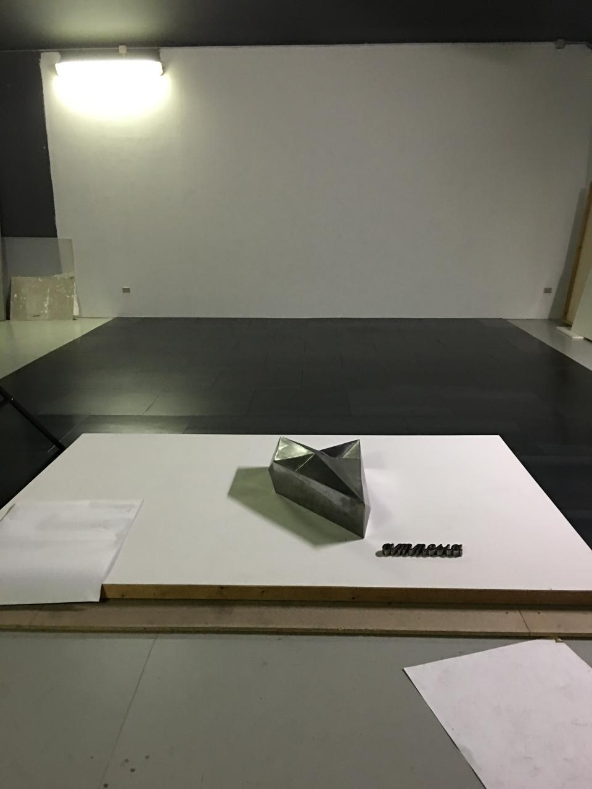

My work:
[miromarion.com](https://miromarion.com)

My production company (stealth):
[reeva.org](https://reeva.org)

*One of more than 180, one meter tall sculptures I created for the Music On campaigns between 2013 and 2019.
Geometrically folded and welded steel. Structure and spontaneity, underground and mainstream.

# My political views, as code

We find ourselves in a gray zone straddling democracy and authoritarianism. The choice is ours. Below, you’ll find tools to escape the manufactured realities and reclaim political power:

## ↓ My Projects
Scroll down for the pinned projects I’m building for this mission

## → Curated Resources

Awesome Privacy
[List of free, open source and privacy respecting services and alternatives to privative services.](https://github.com/pluja/awesome-privacy)

<!--
**escape/escape** is a special repository because its `README.md` (this file) appears on your GitHub profile.
-->