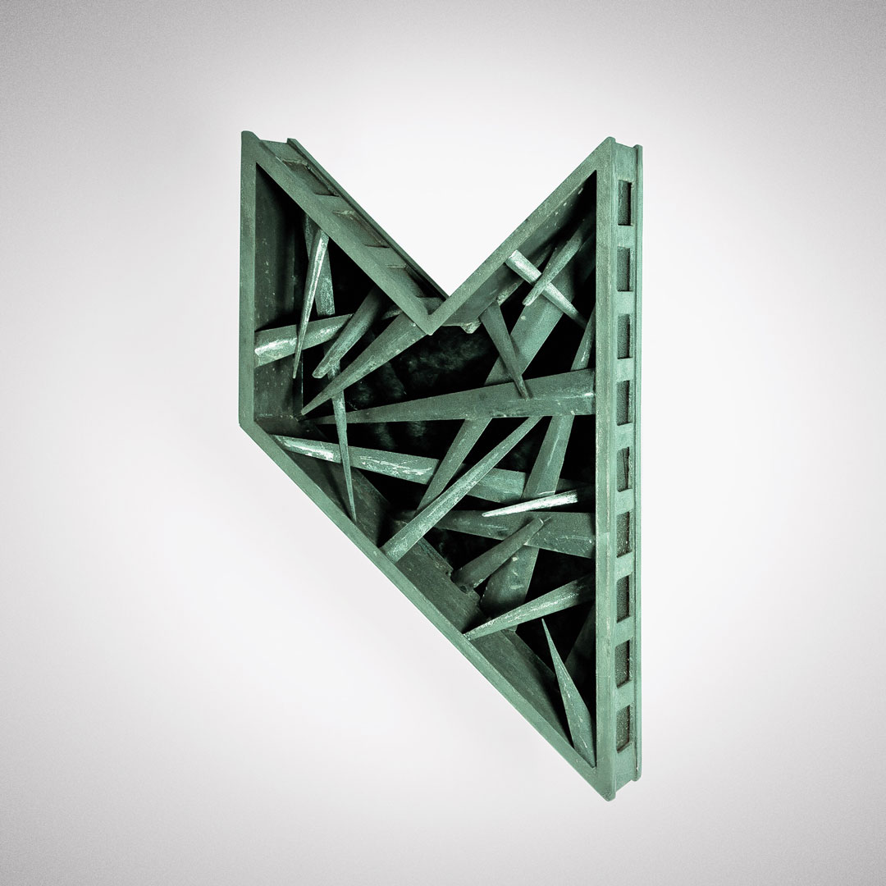

# About

## My work

*Music On New York, 2017. Hand-crafted copper sculpture, 1m high, featuring a minimalist geometric interpretation of the Statue of Liberty crown merged with the Music On logo design. One of over 180 similar sculptures produced for Music On campaigns spanning 2013 to 2019.*

### Private blog and portfolio

[miromarion.com](https://miromarion.com)

### My startup (stealth)

[brenta.io](https://brenta.io)

## My political views — as code

**We find ourselves in a gray zone straddling democracy and authoritarianism. The choice is ours.** Below, you’ll find tools to escape the manufactured realities and reclaim political power:

### ↓ My repos

**Scroll down for the pinned projects I’m building for this mission.** Note: I'm not vibe coding these projects. I’m just using free AI tools to figure out how to make things work, glue things together at the infrastructure level, and put together the essential documentation. If you are interested in vibe coding, I recommend the [MastroGPT 2026 Course](https://nuvolaris.io) by [@Nuvolaris](https://github.com/nuvolaris).

### ↓ (New, in progress) Curated Resources

#### Awesome Privacy

List of free, open source and privacy respecting services and alternatives to privative services

[https://github.com/pluja/awesome-privacy](https://github.com/pluja/awesome-privacy)

#### Privacy Guides (disponibile anche in italiano)

Privacy Guides is an impartial, non-profit organization that is focused on building a strong privacy advocacy community and delivering the best digital privacy and consumer technology rights advice on the internet.

[https://www.privacyguides.org/it/basics/why-privacy-matters/](https://www.privacyguides.org/it/basics/why-privacy-matters/)
